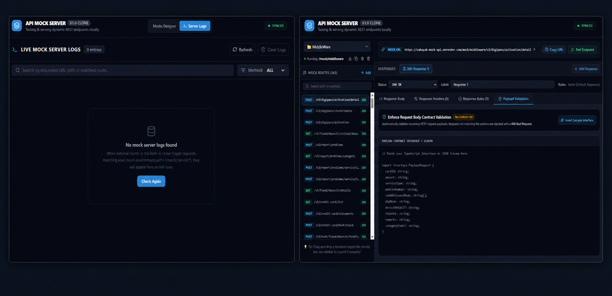

# API Mock Server

API Mock Server is a full-stack mock API workspace for designing isolated environments, creating flexible REST routes, testing payload validation, and watching live request logs in a dark, high-contrast UI.

It is built with Express, React, Vite, Tailwind CSS, and Firestore-backed persistence.

## Screenshots



The collage above combines the main Mocks Designer view and the Server Logs view.

## What It Does

- Create multiple mock environments with their own URL prefixes.
- Define mock routes with dynamic params like `/users/:id` or wildcard matching.
- Configure multiple responses per route, each with status, headers, body, and matching rules.
- Simulate latency to test client timeout and loading-state behavior.
- Validate request bodies against pasted TypeScript interfaces or JSON schema-like objects.
- Inspect live request logs with headers, query parameters, response details, and latency.
- Persist configurations in Firestore so your mock setup survives restarts.

## Key Features

- Multi-environment mock design with isolated route trees.
- Route duplication, reordering, import/export-friendly workflows, and global headers.
- Response editor with JSON body formatting and header editing.
- Rule-based response matching for headers, query params, body values, and route params.
- Automatic CORS handling for `OPTIONS` requests.
- Built-in request logger with filter/search controls.
- Save/discard workflow so edits stay local until you explicitly save.

## Tech Stack

- Frontend: React 19, Vite, Tailwind CSS, Lucide Icons, Motion
- Backend: Node.js, Express, Firebase Admin SDK, tsx, esbuild
- Storage: Firestore

## Project Structure

- [`server.ts`](server.ts): Express server, Firestore persistence, and mock route handler.
- [`src/App.tsx`](src/App.tsx): Main app shell, tabs, save flow, and state management.
- [`src/components/`](src/components): Sidebar, route editor, response editor, settings, and logs UI.
- [`src/lib/`](src/lib): Template parsing and slug utilities.
- [`src/types.ts`](src/types.ts): Shared TypeScript models.

## Local Setup

### Prerequisites

- Node.js 18 or newer
- npm

### Install

```bash
npm install
```

### Start Development Server

```bash
npm run dev
```

Open `http://localhost:3000`.

### Build For Production

```bash
npm run build
npm start
```

## Configuration

The app reads these environment variables:

- `GEMINI_API_KEY`: Used for Gemini-powered features if enabled in the app.
- `APP_URL`: Host URL injected by the platform.
- `FIREBASE_SERVICE_ACCOUNT_JSON`: Required for Firestore persistence outside the AI Studio runtime.
- `FIRESTORE_DATABASE_ID`: Optional. Leave blank to use the default Firestore database.

Example:

```bash
FIREBASE_SERVICE_ACCOUNT_JSON='{"type":"service_account", "...":"..."}'
FIRESTORE_DATABASE_ID=""
```

## Firestore Persistence

The server uses the Firebase Admin SDK and saves data to Firestore when configuration is available.

Important behavior:

- The app starts with local in-memory state.
- Nothing is written to Firestore until you click `Save Changes`.
- Saves now use a Firestore hierarchy of environment, route, and response documents so large mock configurations do not rely on one giant document.
- If you delete every mock environment and then save, Firestore is updated to match that empty state.
- If Firestore is unavailable, the app still runs, but persistence is disabled.

## How To Use

1. Create an environment.
2. Add a route and choose an HTTP method.
3. Set the endpoint path relative to the environment prefix.
4. Add one or more responses.
5. Configure headers, body, status, latency, and optional matching rules.
6. Click `Save Changes`.
7. Test the endpoint through `/mock/:envId/...`.

## Troubleshooting

### Save fails with Firestore errors

- Confirm the Firebase service account belongs to the same project as the Firestore database.
- If you use the default database, leave `FIRESTORE_DATABASE_ID` empty.
- Check that Firestore is enabled for the project.

### Mock route not found

- Confirm the environment ID or slug in the URL.
- Make sure the route path matches after the environment prefix is stripped.
- Check the HTTP method on the route.

### Changes reappear after refresh

- You probably edited the local state but did not click `Save Changes`.
- Refreshing reloads the last saved Firestore state.

## Deployment

This app needs a Node.js runtime because it uses an Express server.

Recommended deployment flow:

1. Build the app with `npm run build`
2. Start the server with `npm start`
3. Set your Firebase service account JSON in the host environment


## Notes On Saving

The save button in the UI writes the current environment list to Firestore only when you explicitly choose to save. That helps prevent accidental overwrites while editing.

If you are working with a long list of routes or environments, the new Firestore layout is much safer than storing everything in one document.
